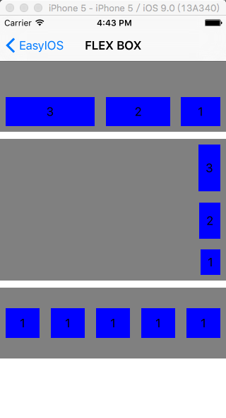

EasyIOS For Swift 2.0
=======

[](http://cocoapods.org/pods/EasyIOS-Swift)
[](http://cocoapods.org/pods/EasyIOS-Swift)
[](http://cocoapods.org/pods/EasyIOS-Swift)
[](http://shang.qq.com/wpa/qunwpa?idkey=562d002e275a8199081313b00580fb7111a4faf694216a239064d29f5238bc91)

* [中文README](/README/Chinese.md)
* [IOSX - EasyIOS Official Forum](https://www.iosx.me)
* [EasyIOS-ObjC](https://github.com/zhuchaowe/EasyIOS)
* [EasyIOS-Swift-Doc](http://swift.easyios.iosx.me)

QQ群:340906744


## DEMO Video
[](http://www.tudou.com/v/aWwPwUhdt5E/&rpid=6059352&resourceId=6059352_04_05_99/v.swf)

## Features

* MVVM : `Model-View-ViewModel` inspired by [Functional Reactive Programming](http://en.wikipedia.org/wiki/Functional_reactive_programming) 
* HTML To Native : Transform HTML&CSS to Native Control.
* FlexBox Support:It can uses Facebook's [flexbox implementation](https://github.com/facebook/css-layout) ，and work well with AutoLayout。



* JavaScript and Native Bridge: We can declare the js function in native and call the js function in html
* DataBinding : We can use the SwiftBond to Bind the data via swift,and use the EZViewModel to Bind the data via html.example `{{title}}`
* Reflect Cocoa Touch : Reflect all the Cocoa Touch Api ,we can use the Cocoa Touch Api via HTML 
* AutoLayout : The HTML layout based on the `AutoLayout`
* Live Load : Edit the HTML and the view in smulator will update automaticly without rebuild your app
* Cryptographic HTML : To make the HTML be safety,we provide the `AES Encryption` to encrypt the HTML
* URLManager : Push or Present the Controller by the custom URL 
* Elegant PullToRefresh : Add  PullToRefresh or InfiniteScrolling by HTML

## HTML To Native

* UITableView With PullReflash
    * `align`,`margin` to control the AutoLayout of the UIView
    * `pull-to-refresh="handlePullRefresh." `,`infinite-scrolling="handleInfinite. PullFooter"` to add the PullRefresh or InfiniteScrolling .
    * `handlePullRefresh.` handle the event by `func handlePullRefresh (tableView:UITableView)` ,you can define it by yourself.
    * `PullFooter` can load the custom PullReflashView 

```HTML
<body>
    <div id="tableview" align="64 0 0 0" content-inset="{0,0,0,0}" type="UITableView"  estimated-row-height="100"  separator-style="None" pull-to-refresh="handlePullRefresh()" infinite-scrolling="handleInfinite() PullFooter">
        <div align="0 0 0 0" type="cell" id="cell" ontap-bind="um.push('{{link}}',true)" >
            
            <span align="top:2 avatar;right:-10" margin="left:12 avatar"  font="15 system" id="title">{{title}}</span>
            <span align="bottom:0 avatar;right:-10" margin="left:12 avatar" font="13 system" text-color="#ACACAC" id="subTitle" style="color:#ACACAC;" link-style="color:green;" >{{subTitle}}</span>
        </div>
        
        <div type="section" id="bgView" background-color="#F2F1F6" >
            <span align="left:15;center-y:0" font="14 system">{{title}}</span>
        </div>
    </div>
</body>
```

* UIScrollView With CSS and JS
    * Use the CSS by `@` for example `@contentAlign`.
   
```HTML
<style>
    .contentAlign{
        edge:0 0 0 0;
    left:0 root;
        right:0 root;
    }
    .inputStyle{
        font-size:15;color:#999999;
    }
</style>
<body>
    <div align="0 0 0 0" type="UIScrollView" background-color="#F3F3F3">
        <div align="@contentAlign">
            
            <div id="username" layer_corner-radius="8" background-color="white" align="* 15 * -15" margin="top:30 logo" height="45">
                <input class="userTextField" id="userTextField" align="edge:10 10 -10 -10;" placeholder-style="@inputStyle" keyboard-type="EmailAddress" style="@inputStyle" placeholder="上面的logo可以被点击"/>
            </div>
            <div id="password" layer_corner-radius="8" background-color="white" align="* 15 * -15" margin="top:13 username" height="45">
                <input id="passwordTextField" secure-text-entry="YES" align="10 10 -10 -10" placeholder="密码" placeholder-style="@inputStyle" style="@inputStyle" />
            </div>
            <button id="submit" style="color:white;font-size:20;" background-color="#3FBCFB" align="* 15 -10 -15" margin="top:25 password" height="45" layer_corner-radius="8" onEvent="touch-up-inside:login()">Login</button>
        </div>
    </div>
</body>

<script>
    function tap(){
        um.present('demo://login',true);
    };
    
    function login(){
        var password = document.getElementById("passwordTextField");
        password.attrs({
            placeholder:"hello",
            secureTextEntry:"NO"
        });
        
<!--        var logo = document.getElementById("logo")-->
<!--        password.callWithObject("test:",logo);-->

        console.log(password.val("text"));
    }
</script>
```

* HTML Label and reusable html
    * `@import(LabelHtml)` to import the `LabelHtml.xml` 
    *  When span set `style="color:#ACACAC;font-size:18px;"` node ,we can use the origin html inner the span tag.
```HTML
<style>
    <!--支持css 样式设置，html中利用@的方式进行调用-->
    .contentAlign{
        edge:0 0 0 0;left:0 root;right:0 root;
    }
</style>

<body>
    <div align="0 0 0 0" type="UIScrollView" background-color="#F3F3F3">
        <div align="@contentAlign">
            <!--span标签设置了style属性则启用富文本模式，span内部可以支持原生HTML的所有属性，具体请看LabelHtml.xml文件-->
            <span align="64 0 0 0" style="color:#ACACAC;font-size:18px;" link-style="color:green;" number-of-lines="0">
                <!--import the xml -->
                    @import(LabelHtml)
            </span>
        </div>
    </div>
</body>
```

* UICollectionView with FlowLayout

```HTML
<body>
    <div id="collectionView" align="0 0 0 0" type="UICollectionView" flow-layout="scroll-direction:Vertical;item-size:{300,50};section-inset:{3,3,0,3};minimum-interitem-spacing:3;minimum-line-spacing:3" content-inset="{64,0,0,0}" background-color="white" pull-to-refresh="handlePullRefresh()" infinite-scrolling="handleInfinite()">
        <div align="0 0 0 0" type="cell"  id="cell"  background-color="red">
            <span align="10 10 -10 -10" font="10 system">{{name}}</span>
        </div>
    </div>
</body>
```

## Declare JS funciton By Swfit

```swift
        //定义一个可以给JS调用的下拉刷新回调方法handlePullRefresh()
        define("handlePullRefresh"){
            let delayTime = dispatch_time(DISPATCH_TIME_NOW,
                Int64(3.0 * Double(NSEC_PER_SEC)))
            dispatch_after(delayTime, dispatch_get_main_queue()) {
                tableView?.pullToRefreshView?.stopAnimating()
            }
        }
```

## MVVM

The MVVM based on the Swift binding framework [SwiftBond](https://github.com/SwiftBond/Bond)

Bond is a Swift binding framework that takes binding concept to a whole new level - boils it down to just one operator. It's simple, powerful, type-safe and multi-paradigm - just like Swift.


## [EasyCoreData](https://github.com/EasyIOS/EasyCoreData)(1.0.1)


## Usage

To run the example project, clone the repo, and run `pod install` from the Demo directory first.

## Requirements

* Swift
* IOS8

## Installation

EasyIOS-Swift is available through [CocoaPods](http://cocoapods.org). To install
it, simply add the following line to your Podfile:

```ruby
platform :ios, '8.0'
use_frameworks!
pod 'EasyIOS-Swift', '~> 2.0'
```

import the EasyIOS

```swift
import EasyIOS
```
## Author

zhuchao, zhuchao@iosx.me

## License

EasyIOS-Swift is available under the MIT license. See the LICENSE file for more info.
